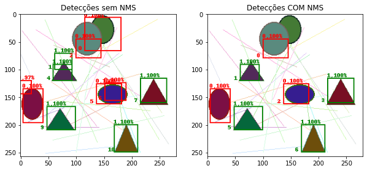

# DETECAO_OBJETOS_3
- Este repositório foi desenvolvido com objetivo de aprender sobre detecção de objetos utilizando conceitos aproximadamente iguais da rede YOLO. 

# Dataset
- Para simplificação, foi desenvolvido um dataset bem simples, com imagens que contenham círculos e triângulos, além de uns riscados como background apenas para "dificultar" um pouco o aprendizado da rede neural. Um exemplo de imagem é:  


# Preparação dos dados
- Uma imagem é dividida em grids, conforme o desenho abaixo, e suas anotações são passadas para o modelo.  

  

- Sendo assim, a rede neural é treinada com imagens que contenham o centro do objeto e com imagens que não contenham objeto, de forma a deixar o dataset de imagens cortadas equilibrado, com a frequência de cada classe aproximadamente igual.  

- Assim, um dataloader de tamanho 8 (batch_size=8) retornaria, por exemplo, as seguintes imagens para treinamento, juntamente com as suas anotações de bbox e classe, onde tipo 0 representa círculo, tipo 1 triângulo e tipo 2 representa vazio.  


# Modelo
- Modelo bem simples (mesmo porque o dataset também é bem simples) a título de aprendizado.  

```
custom_model(
  (net): Sequential(
    (0): Sequential(
      (0): Conv2d(3, 128, kernel_size=(3, 3), stride=(1, 1))
      (1): LeakyReLU(negative_slope=0.1)
      (2): Conv2d(128, 64, kernel_size=(3, 3), stride=(1, 1))
      (3): BatchNorm2d(64, eps=1e-05, momentum=0.1, affine=True, track_running_stats=True) 
      (4): LeakyReLU(negative_slope=0.1)
      (5): MaxPool2d(kernel_size=2, stride=2, padding=0, dilation=1, ceil_mode=False)      
      (6): Conv2d(64, 32, kernel_size=(3, 3), stride=(1, 1))
      (7): BatchNorm2d(32, eps=1e-05, momentum=0.1, affine=True, track_running_stats=True) 
      (8): LeakyReLU(negative_slope=0.1)
      (9): MaxPool2d(kernel_size=2, stride=2, padding=0, dilation=1, ceil_mode=False)      
      (10): Conv2d(32, 16, kernel_size=(3, 3), stride=(1, 1))
      (11): BatchNorm2d(16, eps=1e-05, momentum=0.1, affine=True, track_running_stats=True)
      (12): Flatten(start_dim=1, end_dim=-1)
    )
    (1): Linear(in_features=16, out_features=512, bias=True)
    (2): ReLU()
    (3): Linear(in_features=512, out_features=256, bias=True)
    (4): ReLU()
    (5): Linear(in_features=256, out_features=7, bias=True)
    (6): ReLU()
  )
)
```  

# Função perda

- Percebe-se que a saída do modelo possui (N_BATCH, 7), Ou seja, a segunda dimensão do tensor saída do modelo tem 7 posições, onde as 4 primeiras representam **[xc0, yc0, w, h]** onde essas variáveis são relativas à grid, ou seja, apresentam valores entre 0 e 1 enquanto que as três últimas posições representam um neurônio para cada classe. (No caso, se nosso problema tivesse 80 classes seriam 80 neurônios e nossa saída seria (N_BATCH, 84)). 

- Sendo assim, o cálculo da função perda é dado conforme o script abaixo:  
```
def calculate_loss(self, output, bbox_batch, target_batch):
    
    bbox_pred = output[:,:4]
    target_pred = F.softmax(output[:,4:], dim=-1)

    loss_bbox = F.mse_loss(bbox_pred, bbox_batch)
    loss_target = F.cross_entropy(target_pred, target_batch)

    return (loss_bbox + loss_target)
```  
# Funções IOU e NMS

- Para tarefas de detecção, é necessário utilizar duas funções importantes para aprimorar o resultado. São elas, *Intersection over Union* (IOU) e *Non-maximum Suppression* (NMS), conforme scripts abaixo:  
```
def calculate_iou(bbox1, bbox2):
    # Analisa o bbox mais à esquerda
    (bboxe, bboxd) = (bbox1, bbox2) if (bbox1[0] < bbox2[0]) else (bbox2, bbox1)

    x0e, y0e, x1e, y1e = bboxe  # pegas as variáveis da esquerda apenas para facilitar a fórmula
    x0d, y0d, x1d, y1d = bboxd  # o mesmo para as variáveis do bbox da direita.
    
    (y1t, y0b) = (y1e, y0d) if (y0e < y0d) else (y1d, y0e)  # analisa os elementos mais acima top ou mais abaixo bottom

    inter = max(0, (x1e - x0d)) * max(0, (y1t - y0b))  # intercessão
    union = (x1e - x0e)*(y1e - y0e) + (x1d - x0d)*(y1d - y0d) - inter  # união: somatório das duas áreas - intercessão

    return inter / union
```

```
def nms(deteccoes):
    ious = []
    for k in range(len(deteccoes)): # faça correr todas as deteccoes
        for j in range(k+1, len(deteccoes), 1): # corra todas exceto a detecção[k]
            bbox1, classe1, prob1 = deteccoes[k]
            bbox2, classe2, prob2 = deteccoes[j]
            ious.append([k, j, calculate_iou(bbox1, bbox2)if classe1 == classe2 else 0.0, prob1, prob2])
            # se as classes são diferentes, então iou é zero logo de cara. também adicionamos as probabilidades para pegar a maior.
            # [k, j, bbox, prob[k], prob[j]]
    
    ious = [[ind1, ind2, iou, prob1, prob2] for ind1, ind2, iou, prob1, prob2 in ious if iou != 0.0]
    # retirando as detecções onde não há interceção, ou seja, iou=0.0
    
    indices_excluir = []
    for ind1, ind2, iou, prob1, prob2 in ious:
        menor_ind = ind1 if prob1 < prob2 else ind2 # pega o menor prob, pois essa bbox já não serve mais.
        indices_excluir.append(menor_ind)

    novas_deteccoes = [deteccao for k, deteccao in enumerate(deteccoes) if k not in indices_excluir]
    
    return novas_deteccoes
```

# Resultados

- Alguns resultados podem ser observados, depois de um treinamendo de 10 épocas:  

  

  

  

  

  

# Conclusões

- Percebe-se que é possível desenvolver uma rede neural para detecção de objetos. Tanto os scripts quanto a abordagem do problema aqui não são exatamente as propostas pela rede YOLO, porém tentou-se aproximar alguns dos conceitos apenas para aprendizado.  